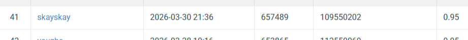

# Visual Recognition using Deep Learning - Homework 1
**Student ID:** 109550202
**Name:** 白詩愷

## Introduction
This project implements an Image Classification pipeline using **ResNet50**. To improve robustness and accuracy, I used a **Model Ensemble** approach combining three different training runs:
- **ResNet50 (Seed 0):** Optimized with Adam.
- **ResNet50 (Seed 42):** Optimized with Adam to test weight initialization variance.
- **ResNet50 (SGD):** Optimized using Stochastic Gradient Descent with momentum.

The final prediction is generated via **Logit Averaging (Soft Voting)** across all three models.

## Environment Setup
Recommended Environment: Python 3.9+ 

### Local Setup (Conda)
```bash
# Create environment
conda create -n VRDL python=3.9 -y
conda activate VRDL

# Install dependencies
pip install -r requirements.txt

## Required Directory Structure
Your local directory should be organized as follows to ensure the training scripts can find the dataset:
bash```

├── data/
│   ├── train/         
│   ├── val/            
│   └── test/          
├── utils.py           
├── train_seed0.py      # ResNet50 + Adam (Seed 0)
├── train_seed42.py     # ResNet50 + Adam (Seed 42)
├── train_sgd.py        # ResNet50 + SGD + Momentum
├── inference.py        # Logit-averaging ensemble script
└── requirements.txt    # List of dependencies

#Usage
Follow these steps in order:

##1. Model Training
Train each individual model. Each script will save its best weights.

- **python train_seed0.py**
- **python train_seed42.py**
- **python train_sgd.py**

##2. Ensemble Inference
Once all three .pth files are generated, run the inference script.
python inference.py

#Performance Snapshot


