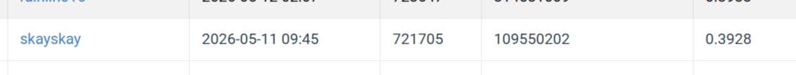

# Visual Recognition using Deep Learning - Homework 3

**Student ID:** 109550202

**Name:** 白詩愷

## Introduction

This project implements an Instance Segmentation pipeline for medical cell images using **YOLOv8m-seg**. To achieve high accuracy on small-scale biological structures, I focused on:

-High-Resolution Inference: Using imgsz=1024 to prevent information loss for tiny cells.

-Recall Optimization: Implementing a confidence threshold of 0.05 to capture dense cellular clusters.

-Automated Data Pipeline: A robust TIF-to-Polygon conversion script with a 10% validation split for metric monitoring.


## Environment Setup

Recommended Environment: Python 3.9+ /  Python 3.10+ 

### Local Setup (Conda)

```bash
# Create environment
conda create -n VRDL python=3.9 -y
conda activate VRDL

# Install dependencies
pip install -r requirements.txt
```

## Required Directory Structure
```text
Organize your directory as follows:

.
├── hw3-data-release/     # Raw dataset
├── yolo_dataset/         # Generated YOLO format data
├── medical.yaml          # YOLO dataset configuration
├── data.py               # TIF to YOLO conversion script
├── train.py              # YOLOv8m training script
├── inference.py          # Submission generation (conf=0.05)
└── requirements.txt      # List of dependencies
```

## Usage

Follow these steps in order:

## 1. Data Preparation

Convert the raw medical TIFF masks into normalized YOLO polygons:

- **python data.py**

## 2. Model Training
Train the baseline model. Weights will be saved to runs/yolo_medical_run/:

## 3. Inference
Generate the COCO-format test-results.json for CodaBench submission:

- **python inference.py**

## Performance Snapshot


