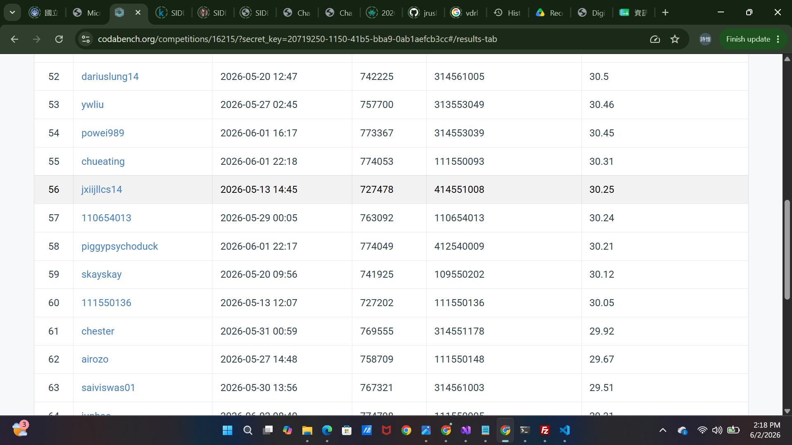

# Visual Recognition using Deep Learning - Homework 4

**Student ID:** 109550202

**Name:** 白詩愷

## Introduction

This project implements an Image Restoration pipeline using PromptIR. The goal is to restore high-quality images from degraded inputs (rain/snow noise) by leveraging prompt-based learning. 
Key focus areas include:

-Metric Optimization: Achieved a PSNR of 30.12 dB on the test set.

-Normalization Strategy: Implemented robust min-max scaling and un-normalization to ensure visual fidelity during inference.

-Qualitative Verification: Developed automated scripts to generate side-by-side [Before | After | Ground Truth] comparisons.


## Environment Setup

Recommended Environment: Python 3.9+ /  Python 3.10+ 

### Local Setup (Conda)

```bash
# Create environment
conda create -n VRDL python=3.9 -y
conda activate VRDL

# Install dependencies
pip install -r requirements.txt
```

## Required Directory Structure
```text
Organize your directory as follows:

.
├── dataset/                # Test and Train data
├── results/
│   ├── samples/            # Generated restored images
│   └── plots/              # Training loss curves
├── model.py                # PromptIR architecture
├── train.py                # Training script
├── inference.py            # Restoration and pred.npz generation
├── utils.py                # Visualization and comparison script
└── requirements.txt        # Project dependencies
```

## Usage

Follow these steps in order:

## 1. Model Training
Train the PromptIR model on the provided dataset. Weights will be saved to checkpoints/promptir_best.pth

- **python train.py**
  
## 2. Inference
Generate the restored images and the pred.npz file CodaBench submission:

- **python inference.py**
  
## 3. Visuals
Generate training curves and side-by-side [Degraded | Restored] comparisons for the final report:

- **python utils.py** 

## Performance Snapshot


